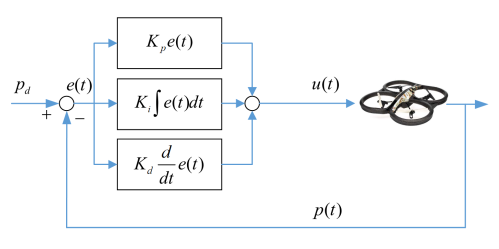

# Navigation, Safe Trajectory and Landing of UAVs in Urban Environment

## Introduction

In urban environments, one of the primary challenges is the development of Navigation Protocols and Methods for UAVs to navigate throughout different zones. Another challenge is the safe landing and takeoff, managing exceptional crash scenarios and minimizing disturbance and potentially harmful incidents caused by some sort of UAV malfunction.

In this article, we will explore the potential problems that can be faced by UAVs while navigating in urban environments, and try to explore existing literature for potential solutions for the same.

## Problem Formulation

### Insufficient information about the Environment 
Most of the proposed path planning algorithms require a prior information about the environment it works in; and in abundance. But in most cases, the information about the environment is insufficient to design/implement a trivial and deterministic Routing Algorithm. Thus, we might need to learn to adapt to environments, which can be done be Reinforcement Learning techniques, as it relies on the data obtained directly from the system, which is the actual realistic scenario of our use case.

### Urban Hinderance
Urban Environments are a lot different from the usual experimental environments, and there are many potential issues that can cause problems for multiple algorithms for drones. Some of them include **Buildings**, which makes it difficult for drones to obtain a Line of Control(LOC) for navigation, degrading GPS accuracy. **Wind Drifts**, makes it difficult for UAVs to calibrate it's position. **Radio-Frequency interference** and **multi-path effects** are some of the other problems we can face in urban environments.

### Dynamic Environment
The urban environment is one of the most dynamic environments. It has continuously moving obstacles and this makes path-planning even more challenging. 

## Preliminaries and Solution

For the resolution to the problems, we aim to build a system where :         
1. UAV should be allowed to continue its mission in situations where GPS is not available or the network is disconnected;      
2. The system that guides the UAVs’ flight should be able to overcome multi-path fading and interference that may occur in urban areas; 
3. When the UAV is landing, the UAV must be able to land safely while avoiding obstacles.      
4. UAV should be able to navigate even on limited real-time data, and randomly dynamic environments. For this we intend to use Reinforcement Learning technique, which can also handle dynamic environment. 

### Proposed Solutions 

> **`Obstacle Avoidance Studies`**      
There are multiple ways to detect objects before collision in real-time. For instance, the proximity of an object can be determined by the rate-of-enlargement of the object, as the UAV camera moves towards it. The objects closer to the UAV enlarge faster than the others (Mori et al.).       
Another technique, by Herisse et al. includes non-linear controller for vertical landing of UAVs, using measurements of average optical flow with the IMU data. Such techniques makes it possible for fast and real-time 3-Dimensional mapping of obstacles and thus real-time collision avoidance.     

> **`Autonomous Landing Systems`**          
Landing points are pre-decided and often private-owned. Thus, there is low chance of dynamic environment or unpredictability in these cases. Using this fact, some methods include using of Graphical Markers etc. along with image-processing for detection of landing spots and safe landing.     
In some cases, such as Police Mandated UAVs, Paramedical UAVs and Package Delivery UAVs, the landing spots might be undecided/random and might not have markers to assist navigation for landing. In these cases, multiple solutions using optical flows has been suggested.Cesetti et al. proposes use of optical flow and feature mapping for depth analysis of land, and determining a relatively flat and safe landing surface.         

> **`Autonomous Navigation Using Reinforcement Learning`**      
The Reinforcement Learning Model is based on a policy determining what action to take, which is denoted in the diagram as u(t), (think of this as an action instruction as LEFT, RIGHT, STAY etc.), and the Propellers controller of the UAV will transform this to electronic signals sent to propellers to slow/speedup propellers to carry out the instructions. Then, the observers like cameras and sensors will register the environment and generate a feedback s_{k+1}, which will be used to update the policy.        
       
We find the model proposed by [1], is based on PID+Q-Learning algorithm, which includes calculation of 3 seperate components Proportional, Integrated and Derivative terms for computing the next instruction u(t). Policy updation is followed as in the Q-Learning algorithm, keeping a proportion of previous policy and a portion of the new policy based on the learning rate. Further, to train fully, there is a seperate probability &epsilon; (small) of taking a random action, to train over the entire search space.           

Thus, the following is the flow for assisted navigation and autonomous landing as discussed in points 1,2 above.        

*** 

# Decentralized Routing Algorithm

In the first step towards realizing the decentralized motion of drones, we explore a collision-avoidance, multi-agent routing algorithm. In this, we use concepts from Cellular Automaton[5], to devise a path-finding algorithm. 

The implementation of the Agent Class, where all the code is implemented, highlighting the decentralized-nature of the algorithm is provided in this [link](https://github.com/vs666/PiedPiper/blob/master/MultiAgent_CollisionAvoidance/agent.cpp).

Notice the following constraints : 
1. No. of Obstacles(cells) + No. of agents << 1/4 (Total No. of Cells). This is done, to avoid deadlock due to congestion. 
2. Agent can cover only one cell at a given timestamp.

Now, we discuss the analysis of the simulation, for different values of N_p (no. of agents) and N_q (no. of blocks of obstacles).       
Here, we have shown results for the agent with observable moore distance = 2.

Observations : 
* As Np+Nq increases, Deadlocks increase. However, notice deadlocks are relatively too small for 5-10 drones, which is a realistic scenario for swarm deployment.
* Mean Completion time varies linearly with the number of Agents. It also varies exponentially/hyperbolically (not confirmed) with increase in number of obstacles.

***

## Conclusion 
We see that there exists a set of technology for fast computation and adaptivity and another set of technology using ML for accurate models. Essentially, there is a tradeoff. Moreover, most algorithms of CV, or UAVs in that prospect are supervised learning based, which lack adaptivity. The best option for more realistic results and models is to use Reinforcement Learning and other technologies like optical flow, particle filter etc. and maintain a sweet spot between adaptability and accuracy.

## Bibliography
1. Autonomous UAV Navigation Using Reinforcement Learning | Huy X. Pham and Hung M. La and David Feil-Seifer and Luan V. Nguyen | 2018 | [URL](https://arxiv.org/abs/1801.
2. Autonomous navigation for low-altitude UAVs in urban areas| Thomas Castelli, Aidean Sharghi, Don Harper, Alain Treméau, Mubarak Shah | 2016 | [URL](https://www.researchgate.net/publication/301845247_Autonomous_navigation_for_low-altitude_UAVs_in_urban_areas)
3. UAV Flight and Landing Guidance System for Emergency Situations | Joon Yeop Lee , Albert Y. Chung , Hooyeop Shim , Changhwan Joe , Seongjoon Park and Hwangnam Kim | 2019 | [URL](https://www.researchgate.net/publication/336582339_UAV_Flight_and_Landing_Guidance_System_for_Emergency_Situations)
4. Cellular Automata based Decentralized Cooperative Collision Avoidance
Control for Multiple Mobile Robots | Erick J. Rodrı́guez-Seda and Catalina K. Rico | [PAPER-LINK](https://ieeexplore.ieee.org/document/8955689/)
