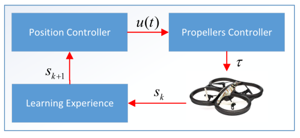

# Mini-Project : UAVs in Urban Environments 

- Varul Srivastava
- 2019111015 (CSD, IIIT Hyderabad)
- Maching Learning Lab, IIIT Hyderabad

We will discuss the current research in the broad domain of UAVs, and discuss use cases related to urban environment. The prime focus of this analysis is on finding the solutions for the following problems : 

1. Optimizations (Latency, Throughput, Range)
2. Privacy (Protection of data collected)
3. Security (Prevention from hacking drones)
4. Network-Architecture (range-independence,latency minimization)
5. Decentralized-Automation of trivial action (using Blockchains and smart-contracts)
6. Obstacle avoidance and Safe takeoff/landing in urban environments.
7. Collision free navigation in dynamic environments (using Cellular Automation for decentralized method and Reinforcement Learning for centralized)

The Summary is divided into 2 broad sections : 
> Decentralized Block-Chain based UAV Protocols     
> Navigation, Safe-Trajectory and Landing of UAVs in Urban Environments 

***

# Decentralized Block-Chain based UAV Protocols     

The current state-of-art for UAVs is a centralized system with a server and most probably a supervising controller. However, decentralized solution is a blockchain based implementation where drones act as nodes, and communicate with each other using an immutable ledger. Further, the development of `Smart-Contracts` made it possible to run complex logic that can bring serverless automation.

In this synopsis of multiple blogs, articles and papers, we will explore how Decentralized Solution using Block-Chains can make the currently working solution of Centralized autonomous drones to higher and might I say, seemingly far-fetched futuristic.

## Why Decentralize

### **1. FASTER COMMUNICATION**

Their decentralized algorithm requires what they say is significantly lower communications bandwidth, as well as lower computation cost, thanks to the distributed way it makes robots share intel on obstacle-free regions in their immediate vicinity.

Instead of each robot broadcasting to every other robot a complete map of safe space around it, the decentralized algorithm has robots only share maps with their immediate neighbors and also has each calculate where neighbors’ maps intersect with their own — sharing only relevant intersected data on to the next neighbor. 

So the idea is that, collectively, the team of robots maintains a comprehensive map of safe terrain while reducing the communication data needed to keep the swarm moving. It is like everyone tells their neighbor about what they know, and they propagate only what is needed to be known by their neighbors.

This results in faster communication, and even though decentralized networks generally have extremely high latency, the introduction of 6G has provided a solution for low-latency communication. Further, multi-casting to immediate neighbors rather than broadcasting to all decreases the communication and processing data further.

Plus, most of the drone applications including Traffic Monitoring, crowd control, surveillance, package-delivery etc. should be done on a private or federated blockchain. So latency for these can be made much lesser than the often familiar public Block-Chains by fine-tuning.

### **2. Security**      

We will discuss multiple potential attacks and how Blokchain protocol prevents them in UAVs. This is an analysis done by [3].
* `Fabrication` : Data-Fabrication is feeding of false data to the drones, and this type of attack is prevented by the immutable nature of the ledger, and the consensus mechanism to append any data.      
Notice this also prevents any data-flooding attacks, to overflow the limited storage capacity of the drones local storage.

* `DDoS` : Pinging with multiple requests to a drone can be a way to consume all bandwidth of the drones and prevent inter agent communications. The trivial way to tackle this problem would be with a dedicated DDoS mitigation service. However, this would consume precious computing resources and time of the system.     
Since BlockChain itself is a decentralized network of nodes, it would be extremely inefficient to attack the network, as the pings would get distributed among all nodes, and flooding with requests would mean to flood all drones with requests, and that is extremely unlikely. Even more so with the proposed 1THz bandwidth of 6G.

* `JAMMING` : This is an attack involving radio blasts to distupt communications by increasing noise. However, in blockchains, the cryptographically-signed, single chain concept (CONFIRM THIS ONCE) prevents any such attack by allowing only relevant data to enter the ledger. 

### **3. PRIVACY**

Data Privacy is maintained by the Block-Chain Protocol. It can use efficient protocols, by the intrinsic modular architecture of the protocol, and inculcate protocols such as the ECC, RSA etc. The Data thus will be encrypted and computationally unfeasible to crack. 

Moreover, the Block-Chain network itself would be either Private or Federated, which means no unauthorized node can join the network and clone the data. 

However, for security, it would be wise to install a `compromised script`, that would run when a drone is compromised (physically captured / opened without authorization), so that it would erase its entire data and all its credentials and keys irreversibly. This would be more useful for Military Applications for National Security.

### **4. AUTOMATION USING SMART CONTRACTS**      

With the addition of Smart Contracts to the Block-Chain protocol, it has become a realizable task to execute some code on the ledger. Now, the complexity of code certainly increases computational, memory and other overheads, but it is not a bottleneck for most cases of automation in drones. 

The Paper [2] considers smart-contracts to achieve the following purposes :         
* detect status of other drones in the swarm and other IoT devices if monitoring
* it discusses an IoT based agriculture scenario where drones can be used to detect faulty sensors and other equipments by running smart contracts to detect erroneous messages, low battery or otherwise.
* this example can be extended to our case of Urban-City where monitoring drones can detect erroneous messages throughout the city and inform / perform repairs.
* another implementation of smart contracts could be to synchronize flight of swarm, individual movements, take-off and landing, geo-spacial mapping of fellow-drones of the swarm and other operations that might be needed to run. 

The following image explains one of the applications of the smart-contracts of drones, in IoT based agriculture and the drones use in detection and/or maintaining of erroneous IoT devices.

![Drones Smart Contract Execution Flowchart (Agriculture Case Example)[2]](./images/drone-smart-contract.png)

## **5. SPATIOTEMPORAL INDEPENDENCE** 
The blockchain based execution of autonomous services, and the decentralized control of the system allows navigation beyond centrally controlled region. 
The area which can be navigated by the drones had correlation with both, the battery capacity of drones and signal range. However, in decentralized case, the signal-range correlation is eradicated. This means as the light-weight battery industry flourishes, the range of drones will also increase drastically.

## **6. OTHER PERFORMANCE OPTIMIZATION**       

Decentralization using Block-Chains usually leads to excellent optimization in work throughput when compared to centralized architectures. It is analysed in [2] over the IoT based agriculture maintainance via drones. The results show significant contrast when shown over large range and capacity.

***

## BLOCKCHAIN ARCHITECTURE

### The Blockchain Data Structure 

A brief introduction to the block-chain data structure. It is an append-only singly-linked link list with each node having a hash-pointer based tree (known as the merkel-tree), which stores the data. Along with this, there is Hash of the previous block/node, nonce, and other metadata in the block/node's head.

The following image gives a brief explanation of the data structure.

#### Types of Networks 

Blockchain has multiple types of networks based on accessability and control. They are : 

**`PUBLIC NETWORK - `** This network has no restrictions, and any person with an internet connection can join the network. In this case, there is advantage of transparency, trust, cutting off any middleman and security. However, the disadvantages include scalability issue, excessive power and memory consumption and lack of transitional speed.        
Noticing this, we conclude that transparency is to be avoided in most applications of UAVs, and trust is a non-essential advantage. However, power-consumptions and memory limitations are huge constraints that can drastically affect UAV performance and throughput.

**`PRIVATE NETWORK - `** This network is usually used within an organization where only certain members are allowed to join the network. The disadvantages include less secure, single point of failure and problems in achieving trust. However, it has high Transactions per second, and highly scalable.

**`CONSORTIUM / FEDERATED NETWORK - `** This is a hybrid of the public and private blockchains. It provides the access control, while preserving the decentralized nature of the network.       
The advantage of such a network is its access control, higher    scalability and transactions per-second than public network and overall higher throughput. The disadvantages are extremely low, including less transparency and annonymity.

Analysing the networks, we notice that consortium based network is the best option to implement in case of UAVs, for various different scenarios.

Notice another minor optimization. For access control, we can use smart-contract based authentication instead of server side blacklisting/whitelisting mechanism which is centralized.

### The 6G based BlockChain Communication Scheme

The proposed scheme is divided into 5 Layers, namely : 
1. Data Sensing Layer 
2. Block-Chain Layer
3. UAV Layer 
4. Application/Control Layer
5. Communication Layer 

We will explore the layers one by one :      

**`DATA SENSING LAYER`**        
This Layer consists of receptors to receive data from IoT based devices, and data collected by the UAVs own sensors, which is of different form and from different sources. Notice that this data is represented by the set {S1,S2,...Sn}.      
Now, we treat each unit of data as a transaction digitally signed by the receiver node UAV. Hash-Tree of these transactions are computed and the merkel tree is constructed. Notice that time-stamp of the received data is also noted, as it will lead to avoidance of any clashes later on.

Now, all nodes can periodically append a block to the ledger, containing the data it has collected. Repeated data can be deleted by individual nodes via dedicated script that runs whenever a new block is added.

**`BLOCK-CHAIN LAYER`**     
As already discussed, the blockchain layer will have a Consortium Blockchain Network. The advantages of features like smart-contract would be the elimination of trust on any 3rd parties. Consensus is reached by any of the consensus protocols among PoW, PoS, PoC, delegated-PoS etc. Each of the following consensus protocols have their own advantages and limitations. Due to the versatile nature of the Smart Contracts of Ethereum protocol, we propose to use it.(Discuss after studying all of them)

One of the problems in using Ethereum is the high transaction/storage costs. To overcome such a high storage cost issue in Ethereum, an IPFS protocol is used in the proposed scheme, which is immutable, distributed, and free of cost data storage. It accelerates the data downloading speed with the hosting of data parts to other peers by exploiting minimum network bandwidth[3]. 

**`UAV LAYER`**     
In this layer, UAVs are flying to sense data from the D_sl, which it can read/retrieve with extremely low latency as the ledger where D_sl is stored. The UAVs have three components of velocity, the angles (&theta;,&phi;). These parameters is better to be maintained either using a separate dedicated processing unit, because it will have better performance. However we can make use of multiprocessing capacity of existing hardware and make do.     
Now, we can see velocity components [v_x(t),v_y(t),v_z(t),&theta;,&phi;].
We can use normal physics and laws of motions, but I think this is not within the scope of discussion.

**`APPLICATION AND CONTROL LAYER`**         
The Application/Control layer can read and process the ledger information. It also allows the Applications, RL Models, and manual controls to be ran from the control centre in case of non-autonomous or semi-autonomous drones.       
Other than this, we can also attain data from the ledger from time to time and perform all sorts of operations, analysis etc. on it based on our applications.

**`COMMUNICATION LAYER`**
The communication layer can be devised of either of 5G and 6G, but it is more efficient if we use 6G. It adds the advantages such as Ultra high latency, Extremely high latency, Extremely high reliability , 1 cm 3D position precision, Wide Range (10^7 km).

|Protocol|Latency|
|-|-|
|LTE-A|<= 20ms|
|for 5G|<= 5ms|
|for 6G|<= 0.1ms|

This exceptional low latency is preferred because the blockchain layer, as it is will add a little time delay no-matter how privatized or optimized. This layer is just for inter-drone and control-center transmission of data.

***

## Decentralized Routing Algorithm

In the first step towards realizing the decentralized motion of drones, we explore a collision-avoidance, multi-agent routing algorithm. In this, we use concepts from Cellular Automaton[5], to devise a path-finding algorithm. 

The implementation of the Agent Class, where all the code is implemented, highlighting the decentralized-nature of the algorithm is provided in this [link](https://github.com/vs666/PiedPiper/blob/master/MultiAgent_CollisionAvoidance/agent.cpp).

Notice the following constraints : 
1. No. of Obstacles(cells) + No. of agents << 1/4 (Total No. of Cells). This is done, to avoid deadlock due to congestion. 
2. Agent can cover only one cell at a given timestamp.

Now, we discuss the analysis of the simulation, for different values of N_p (no. of agents) and N_q (no. of blocks of obstacles).       
Here, we have shown results for the agent with observable moore distance = 2.

Observations : 
* As Np+Nq increases, Deadlocks increase. However, notice deadlocks are relatively too small for 5-10 drones, which is a realistic scenario for swarm deployment.
* Mean Completion time varies linearly with the number of Agents. It also varies exponentially/hyperbolically (not confirmed) with increase in number of obstacles.

***

# Navigation, Safe Trajectory and Landing of UAVs in Urban Environment

## Introduction

In urban environments, one of the primary challenges is the development of Navigation Protocols and Methods for UAVs to navigate throughout different zones. Another challenge is the safe landing and takeoff, managing exceptional crash scenarios and minimizing disturbance and potentially harmful incidents caused by some sort of UAV malfunction.

In this article, we will explore the potential problems that can be faced by UAVs while navigating in urban environments, and try to explore existing literature for potential solutions for the same.

## Problem Formulation

### Insufficient information about the Environment 
Most of the proposed path planning algorithms require a prior information about the environment it works in; and in abundance. But in most cases, the information about the environment is insufficient to design/implement a trivial and deterministic Routing Algorithm. Thus, we might need to learn to adapt to environments, which can be done be Reinforcement Learning techniques, as it relies on the data obtained directly from the system, which is the actual realistic scenario of our use case.

### Urban Hinderance
Urban Environments are a lot different from the usual experimental environments, and there are many potential issues that can cause problems for multiple algorithms for drones. Some of them include **Buildings**, which makes it difficult for drones to obtain a Line of Control(LOC) for navigation, degrading GPS accuracy. **Wind Drifts**, makes it difficult for UAVs to calibrate it's position. **Radio-Frequency interference** and **multi-path effects** are some of the other problems we can face in urban environments.

### Dynamic Environment
The urban environment is one of the most dynamic environments. It has continuously moving obstacles and this makes path-planning even more challenging. 

## Preliminaries and Solution

For the resolution to the problems, we aim to build a system where :         
1. UAV should be allowed to continue its mission in situations where GPS is not available or the network is disconnected;      
2. The system that guides the UAVs’ flight should be able to overcome multi-path fading and interference that may occur in urban areas; 
3. When the UAV is landing, the UAV must be able to land safely while avoiding obstacles.      
4. UAV should be able to navigate even on limited real-time data, and randomly dynamic environments. For this we intend to use Reinforcement Learning technique, which can also handle dynamic environment. 

### Proposed Solutions 

**`Obstacle Avoidance Studies`**      
There are multiple ways to detect objects before collision in real-time. For instance, the proximity of an object can be determined by the rate-of-enlargement of the object, as the UAV camera moves towards it. The objects closer to the UAV enlarge faster than the others (Mori et al.).       
Another technique, by Herisse et al. includes non-linear controller for vertical landing of UAVs, using measurements of average optical flow with the IMU data. Such techniques makes it possible for fast and real-time 3-Dimensional mapping of obstacles and thus real-time collision avoidance.         

**`Autonomous Landing Systems`**          
Landing points are pre-decided and often private-owned. Thus, there is low chance of dynamic environment or unpredictability in these cases. Using this fact, some methods include using of Graphical Markers etc. along with image-processing for detection of landing spots and safe landing.     
In some cases, such as Police Mandated UAVs, Paramedical UAVs and Package Delivery UAVs, the landing spots might be undecided/random and might not have markers to assist navigation for landing. In these cases, multiple solutions using optical flows has been suggested.Cesetti et al. proposes use of optical flow and feature mapping for depth analysis of land, and determining a relatively flat and safe landing surface.         

**`Autonomous Navigation Using Reinforcement Learning`**      
The Reinforcement Learning Model is based on a policy determining what action to take, which is denoted in the diagram as u(t), (think of this as an action instruction as LEFT, RIGHT, STAY etc.), and the Propellers controller of the UAV will transform this to electronic signals sent to propellers to slow/speedup propellers to carry out the instructions. Then, the observers like cameras and sensors will register the environment and generate a feedback s_{k+1}, which will be used to update the policy.        
       
We find the model proposed by [1], is based on PID+Q-Learning algorithm, which includes calculation of 3 seperate components Proportional, Integrated and Derivative terms for computing the next instruction u(t). Policy updation is followed as in the Q-Learning algorithm, keeping a proportion of previous policy and a portion of the new policy based on the learning rate. Further, to train fully, there is a seperate probability &epsilon; (small) of taking a random action, to train over the entire search space.            

Thus, the following is the flow for assisted navigation and autonomous landing as discussed in points 1,2 above.        

***

## Conclusion 

We see that there exists a set of technology for fast computation and adaptivity and another set of technology using ML for accurate models. Essentially, there is a tradeoff. Moreover, most algorithms of CV, or UAVs in that prospect are supervised learning based, which lack adaptivity. The best option for more realistic results and models is to use Reinforcement Learning and other technologies like optical flow, particle filter etc. and maintain a sweet spot between adaptability and accuracy.

***

# BIBLIOGRAPHY
## Bibliography for PART 1

1. Tech Crunch Blog - MIT creates a control algorithm for drone swarms | Natasha Lomas | [HYPER-LINK](https://techcrunch.com/2016/04/22/mit-creates-a-control-algorithm-for-drone-swarms/)

2. Blockchain-based IoT Platform for Autonomous Drone Operations Management. The Second Workshop on DroneCom in Conjunction with ACM MobiCom 2020, Sep 2020, London, United Kingdom |  Samir Dawaliby, Arezki Aberkane, Abbas Bradai | [PAPER-LINK](https://hal.archives-ouvertes.fr/hal-02903033v2)

3. Blockchain-assisted secure UAV communication in 6G environment: Architecture, opportunities, and challenges | Rajesh Gupta, Anuja Nair, Sudeep Tanwar, Neeraj Kumar |  [PAPER-LINK](https://ietresearch.onlinelibrary.wiley.com/doi/full/10.1049/cmu2.12113) 

4. Cellular Automata based Decentralized Cooperative Collision Avoidance
Control for Multiple Mobile Robots | Erick J. Rodrı́guez-Seda and Catalina K. Rico | [PAPER-LINK](https://ieeexplore.ieee.org/document/8955689/)

5. Elementary Cellular Automaton and Its Applications in Computer Science | Varul Srivastava | [BLOG-LINK](https://iq.opengenus.org/elementary-cellular-automaton/)

6. Public-vs-Private-vs-Protected Blockchain | Toshendra Kr. Sharma |  [Article Link](https://www.blockchain-council.org/blockchain/types-of-blockchains-explained-public-vs-private-vs-consortium/)

## Bibliography for PART 2

1. Autonomous UAV Navigation Using Reinforcement Learning | Huy X. Pham and Hung M. La and David Feil-Seifer and Luan V. Nguyen | 2018 | [URL](https://arxiv.org/abs/1801.pdf)
2. Autonomous navigation for low-altitude UAVs in urban areas| Thomas Castelli, Aidean Sharghi, Don Harper, Alain Treméau, Mubarak Shah | 2016 | [URL](https://www.researchgate.net/publication/301845247_Autonomous_navigation_for_low-altitude_UAVs_in_urban_areas)
3. UAV Flight and Landing Guidance System for Emergency Situations | Joon Yeop Lee , Albert Y. Chung , Hooyeop Shim , Changhwan Joe , Seongjoon Park and Hwangnam Kim | 2019 | [URL](https://www.researchgate.net/publication/336582339_UAV_Flight_and_Landing_Guidance_System_for_Emergency_Situations)

***